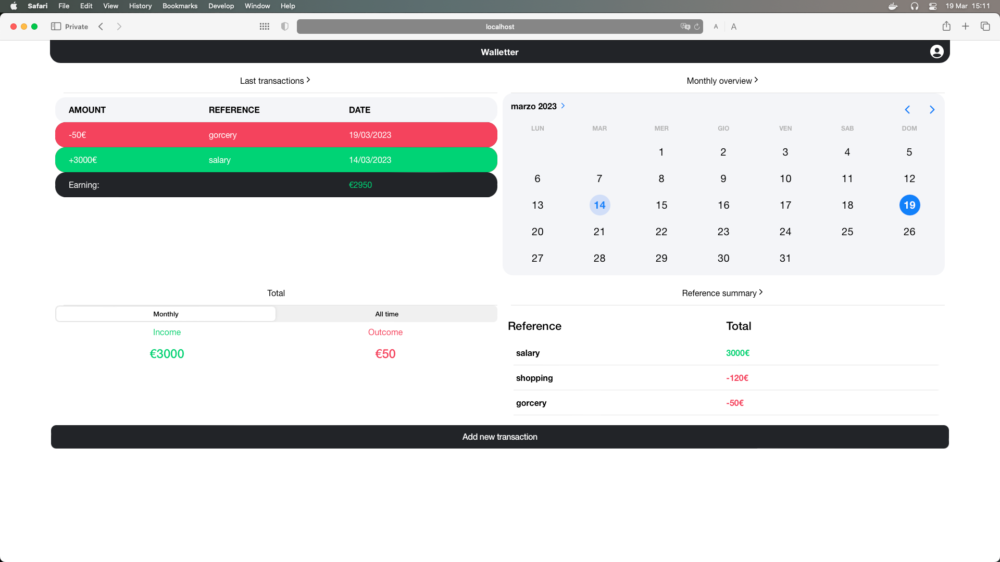
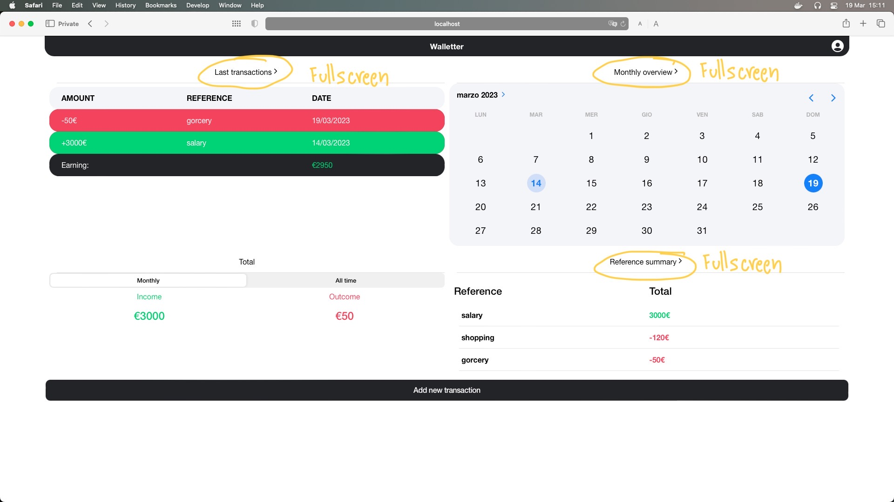
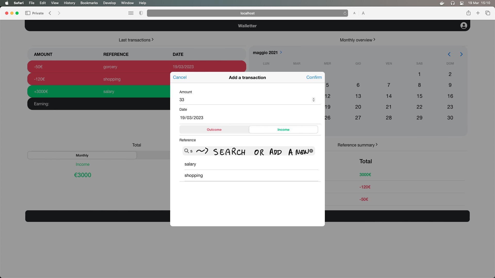
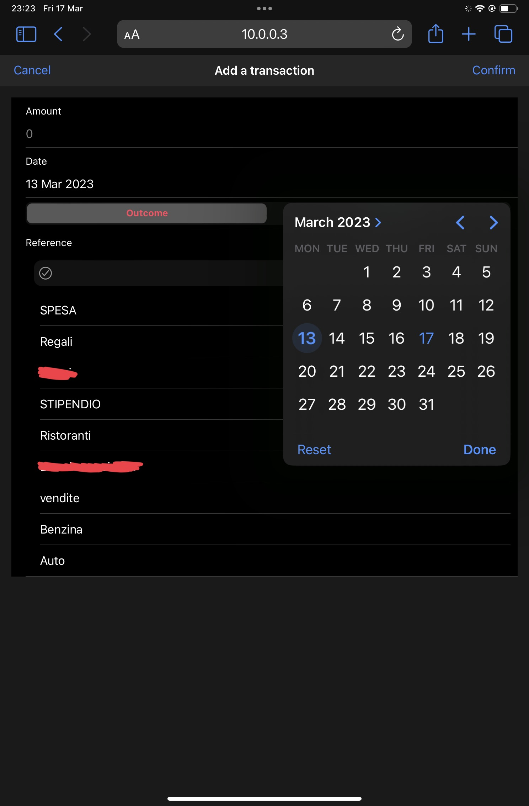
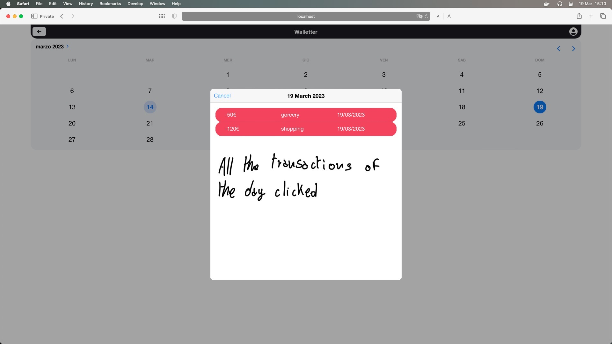
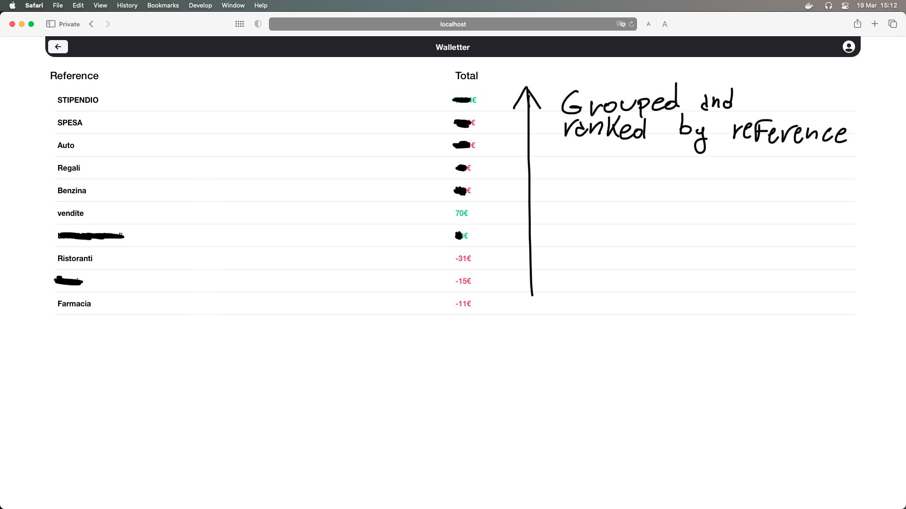
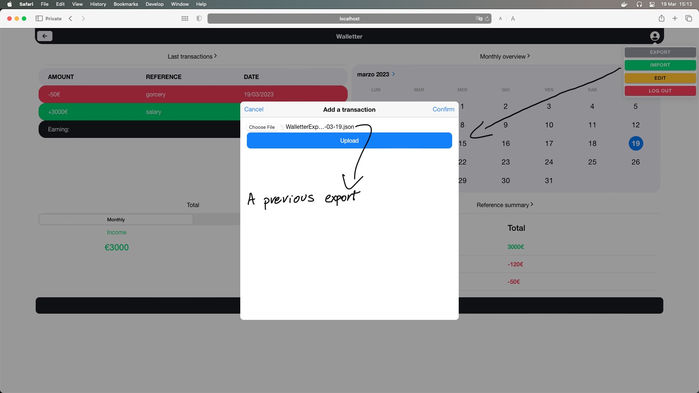
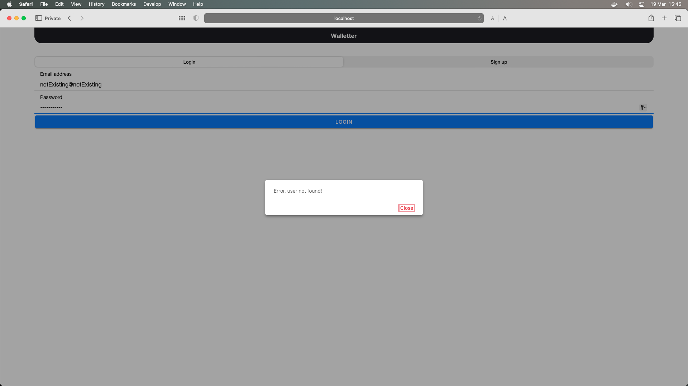

# Walletter

~ A simple personal finance tool ~

You can do two things with money: earn it or spend it.

Every **transaction** has the same metadata:

- Amount of money (spent or earned)
- Date of transasction
- Reference/Motivation (eg. salary, gorcery, gift etc)
- Verse (if is an income or an outcome)

So the database goes along.

## Database

Made with Mongo, with two collections we can do the job.

WT_TRANSACTIONS
```json
{
    "Email":"alberto@morini",
    "Amount": 44,
    "Date":"2023-03-10",
    "IsOutcome": true,
    "Reference":"Gorcery"
}
```
WT_USERS

```JSON
{
    "Email": "user@email",
    "Password": "98a3629dc3d351915dfe959221ccb812",//md5 of psw
    "Premium": false //not used right now
}
```


## UX

The dashboard start with 4 widget, clicking some of these you can go in fullscreen mode and see more results.







You can add a new transaction and searching for existing reference or add a new one.



From my iPad (have to hide some reference, sorry)



### Various widget

Fullscreen of calendar, clicking a day 


Full screen of grouped (is from my personal account, had to hide, sorry again)



You can export or import a backup, saved on JSON




But first, you need to login!




## Usage

NodeJS and MongoDB are required.
> You can run MongoDB in docker as well.

Once executed the server (node server.js) and the client (npm start), go to the server port (1999) will ask you to trust of self-signed certified, than, will redict you to the app
So -> https://10.0.0.3:1999 and boom we there.
> 10.0.0.3 is my Mac's private IP, config yours into the ServerConfig.json into src folder of Walletter app


Runnning the client in https mode:

1. `npm run build`
2. `npx serve -s build --listen 3000 --ssl-cert cert.pem --ssl-key key.pem`

**there's "starter.sh" a shell scriptt which start docker/client/server all in once**


## Certificates

### Building on iOS

`ionic capacitor build ios --prod`

- via xcode we build the app and bring into the device
- we need to allow the developer mode in the setting of the device (to run with a physical device)... Then trust the author on the general settings

#### trust the self signed certified.


### HTTPS 
The certified and the private key (that you don't see in this repo), are self-signed, you've to generate yours.
//TODO: COMPLETE


## TODO
- at the server startup check if collections exists
- logs
- bug fix: data is null, but the transactions has been saved --> calendar error etc. !!!
- transaction modal if new user