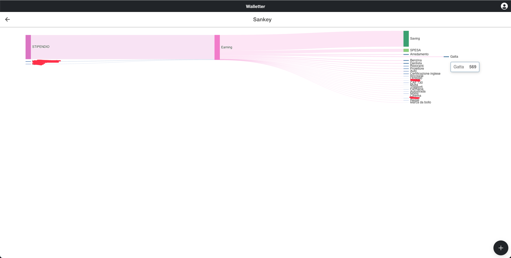
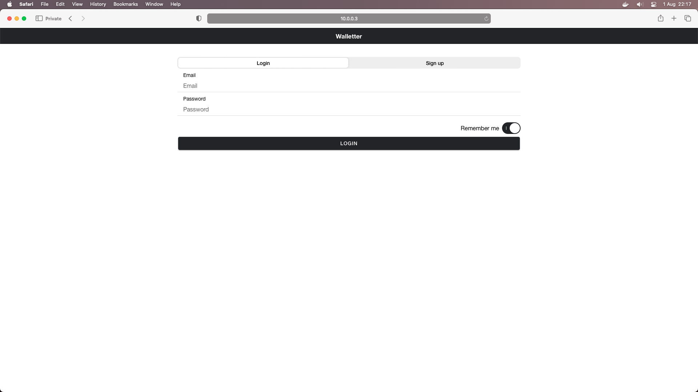

# Walletter

• A simple and minimal, personal finance tool <br/>
• You can do two things with money: earn it or spend it.

## IDEA: 
Every **transaction** has the same metadata:

- Amount of money (spent or earned)
- Date of transasction
- Reference/Motivation (eg. salary, gorcery, gift etc)
- Verse (if is an income or an outcome)

So the database goes along.

## Database

Made with Mongo, with two collections we can do the job.

WT_TRANSACTIONS
```json
{
    "Email":"alberto@morini",
    "Amount": 44,
    "Date":"2023-03-10",
    "IsOutcome": true,
    "Reference":"Gorcery"
}
```
WT_USERS

```JSON
{
    "Email": "user@email",
    "Password": "98a3629dc3d351915dfe959221ccb812",//md5 of psw
    "Premium": false //not used right now
}
```


## UX

The dashboard start with 4 widget, clicking some of these you can go in fullscreen mode and see more results.


You can add a new transaction and searching for existing reference or add a new one.


From my iPad (have to hide some reference, sorry)


### Various widget

Sankey


Fullscreen of calendar, clicking a day 


Full screen of grouped (is from my personal account, had to hide, sorry again)


You can export or import a backup, saved on JSON


But first, you need to login!




## Usage

NodeJS and MongoDB are required.
> (suggestion) You can run MongoDB in docker as well.

Once executed the server (node server.js) and the client  go to the server port (1999) will ask you to trust of self-signed certified, than, will redict you to the web app.

### Run the server
`$ node ./walletter/server/server.js`
> 10.0.0.3 is my Mac's private IP, config yours into the ServerConfig.json into src folder of Walletter client folder


Runnning the client in https mode:
1. `$ cd ./walletter/Walletter/`
2. `npm run build` 
3. `npx serve -s build --listen 1998 --ssl-cert cert.pem --ssl-key key.pem`


**there's "starter.sh" a shell script which start docker/client/server all in once**


## Certificates

### Building on iOS

`ionic capacitor build ios --prod`

- via xcode we build the app and bring into the device
- we need to allow the developer mode in the setting of the device (to run with a physical device)... Then trust the author on the general settings

### Trust the self signed

- Import the certificate generated into the device
- Find in "files" -> then open 

> https://support.apple.com/en-us/HT204477

## TODO
- at the server startup check if collections exists
- logs
